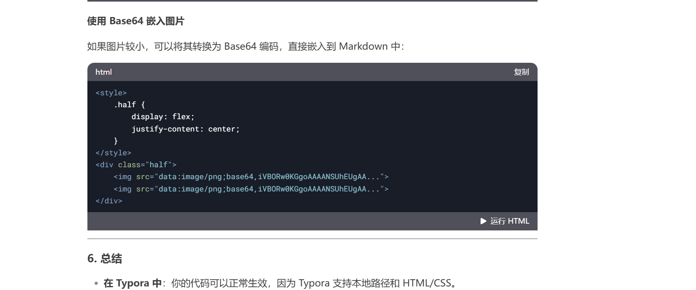

# 教程简介

【8分钟让你快速掌握Markdown】 https://www.bilibili.com/video/BV1JA411h7Gw/?share_source=copy_web&vd_source=463bd6b60327fe3bab7ae143cef87ba7

- typora（⭐⭐⭐⭐⭐，免费，附加功能齐全，win，mac，linux）
- StackEdit（⭐⭐⭐⭐，免费，附加功能齐全，chrome应用，可以使用Google drive同步）
- dillinger（⭐⭐⭐⭐，免费，附加功能齐全，chrome应用，可以使用Google drive、Dropbox、OneDrive等同步） 
- QOwnNotes（⭐⭐⭐⭐，附加功能齐全，甚至可以设置同步服务器，win，mac，linux） 
- VSCode（⭐⭐⭐免费，需安装插件，附加功能较少，win,mac,linux） 
- Haroopad（⭐⭐免费，win，mac，linux） - MacDown（⭐⭐⭐mac） 
- Mou（⭐⭐⭐mac，以前免费好像要开始收费了） - markdownpad（⭐⭐有收费版和免费版，Windows） 
- 有道云笔记、为知笔记、印象笔记（⭐，这三个有些常用功能可能收费）

- 支持markdown的写作平台：GitHub、码云、简书、segmentfalut、CSDN等等

- Markdown 语法参考 : https://www.runoob.com/markdown/md-tutorial.html 
- 表情全部名称：https://unicode.org/emoji/charts/full-emoji-list.html


# 块级元素

## 标题

‘#’ 最多有6个分支

## 引用

> 这是一段引用

## 列表

### 有序列表：

1. 有
2. 序

### 无序列表：

* 无
- 表

### 任务列表：

- [ ] 任务
- [x] 加x可以完成

## 代码

代码块：三个反引号 在esc下面

```python
print('Hello world!')
```

## 公式

数学公式：使用LaTex
$$
\frac{\partial f}{\partial x} = 2\sqrt{a}x
$$

$$
\begin{align*}
x &= 1 + 5y^2 \\
  &= 3z^3
\end{align*}
$$

## 表格

表头 对齐方式（冒号在左边是左对齐，右边是右对齐，左右都有是居中）

|姓名|年龄|成绩|
|:---|---:|:---:|
|张三|19|99|

## 脚注

一键三连[^三连]

[^三连]:点赞、投币、收藏

## 横线

下面是横线

---


# 行内元素

## 链接

注释引号前有个空格

[百度](baidu.com '一个搜索引擎')

## 引用

1. [百度][id],[百度][id],[百度][id],[百度][id]

[id]:baidu.com '一个搜索引擎'

直接在其他地方复制[百度][id]即可，更改网址只需更改上面id那行，比第一个链接一个一个改方便

2. 请参考[标题1](#标题1)

圆括号内的名字要和标题名字相同

3. URL

协议＋域名，会自动识别生成链接

http://www.baodu.com

4. 图片

！[替代文本]（网址  ‘注释’）


## 格式

* 斜体*

* *加粗**

* `print()`

* <u>下划线</u>   是html的标签表示

*  :smile:

* $\theta=x^2$ 

* H~2~O      X^2^

* ==高亮==

* html嵌入代码能直接播放网页视频等

<iframe src="//player.bilibili.com/player.html?isOutside=true&aid=327623069&bvid=BV1JA411h7Gw&cid=171385214&p=1" scrolling="no" border="0" frameborder="no" framespacing="0" allowfullscreen="true"></iframe>


## HTML

<style>
    .a {
        display: flex;
        justify-content: center;
        align-items: center;
    }
</style>
<body>
	
</body>


<div class="a">
	
	
</div>