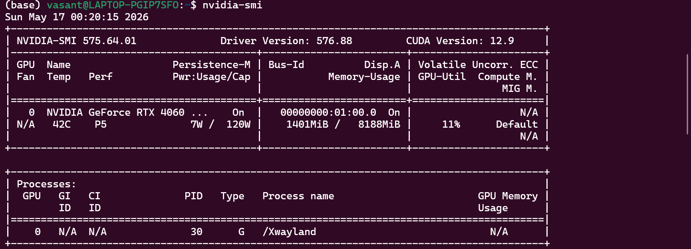
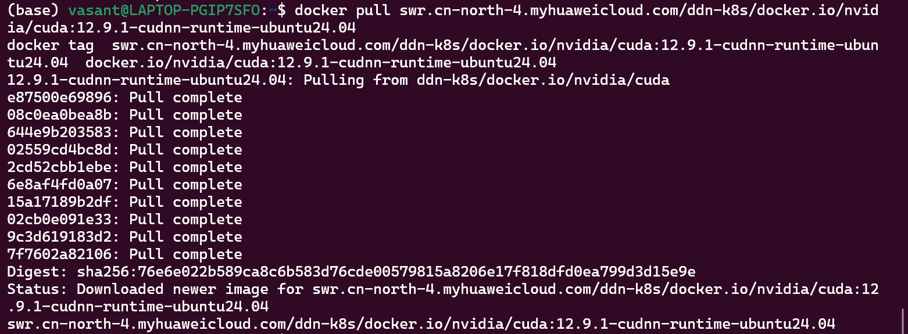
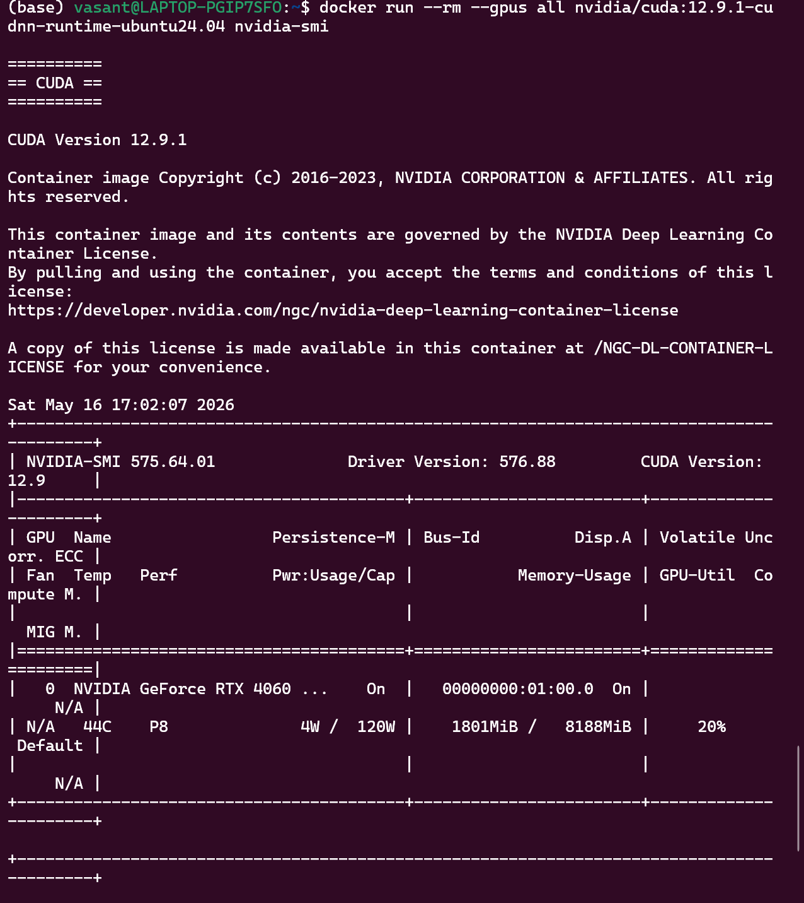
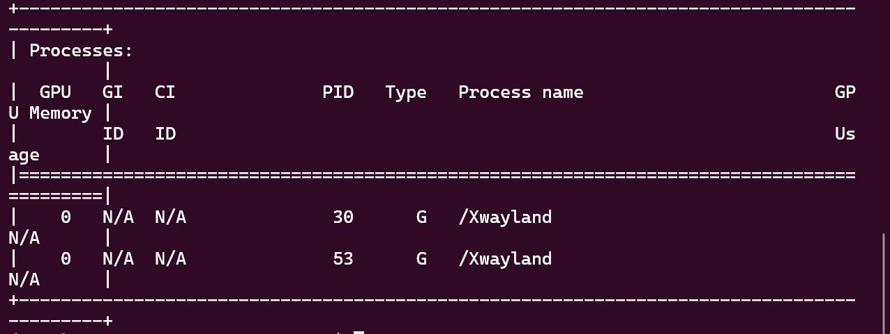
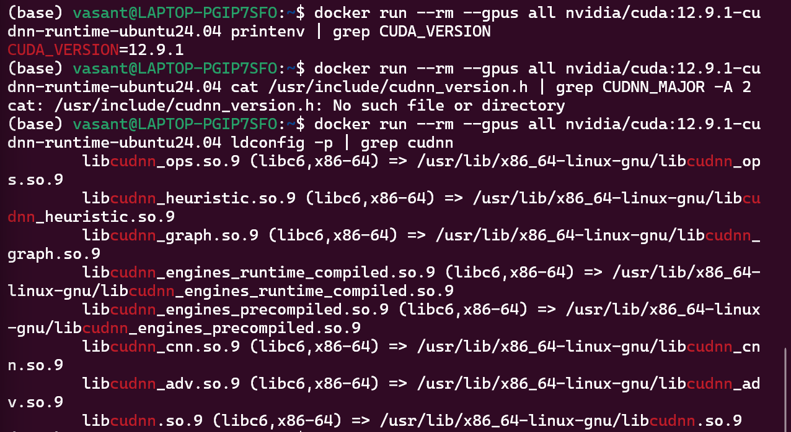

[docker.io/nvidia/cuda 项目中国可用镜像列表 | 高速可靠的 Docker 镜像资源](https://docker.aityp.com/r/docker.io/nvidia/cuda)


[Windows 下 Docker + WSL2 + NVIDIA GPU 完整配置指南（2026 最新实测） - 技术栈](https://jishuzhan.net/article/2043880165734940674)

[NVIDIA CUDA 镜像 Docker 容器化部署全流程 - 源码舞动 - 博客园](https://www.cnblogs.com/sourcecodebeat/p/19132724/nvidia-cuda-docker)



上述镜像安装



运行测试






## ✅ 验证新镜像

运行以下命令确认一切正常：

### 1. 基础 GPU 访问测试
```bash
docker run --rm --gpus all nvidia/cuda:12.9.1-cudnn-runtime-ubuntu24.04 nvidia-smi
```

### 2. 确认 CUDA 版本
```bash
docker run --rm --gpus all nvidia/cuda:12.9.1-cudnn-runtime-ubuntu24.04 printenv | grep CUDA_VERSION
```

### 3. 确认 cuDNN 版本
```bash
docker run --rm --gpus all nvidia/cuda:12.9.1-cudnn-runtime-ubuntu24.04 cat /usr/include/cudnn_version.h | grep CUDNN_MAJOR -A 2
```
或者更简单的方法：
```bash
docker run --rm --gpus all nvidia/cuda:12.9.1-cudnn-runtime-ubuntu24.04 ldconfig -p | grep cudnn
```

## 📊 镜像标签说明

你选择的 `12.9.1-cudnn-runtime-ubuntu24.04` 包含：

| 组件        | 状态 | 说明                                        |
| ----------- | ---- | ------------------------------------------- |
| CUDA 12.9.1 | ✅    | CUDA 运行时库                               |
| cuDNN       | ✅    | NVIDIA 深度学习优化库                       |
| TensorRT    | ❌    | 不包含（推理优化库，可选）                  |
| nvcc 编译器 | ❌    | 不包含（PyTorch/TensorFlow 预编译包不需要） |
| nvidia-smi  | ✅    | GPU 监控工具                                |


## 📝 常用操作

### 查看已安装的镜像
```bash
docker images | grep nvidia/cuda
```

### 运行交互式容器（便于开发）
```bash
docker run --rm --gpus all -it \
  -v /home/vasant/projects:/workspace \
  nvidia/cuda:12.9.1-cudnn-runtime-ubuntu24.04 \
  bash
```

### 清理测试过的临时容器
```bash
# 查看所有容器（包括已停止的）
docker ps -a

# 删除所有已停止的容器
docker container prune
```



完美！✅ 你的镜像**完全正常**，cuDNN 已经正确安装。之前的错误只是因为 `cudnn_version.h` 头文件不在标准路径（这是 runtime 镜像的正常现象）。

## ✅ 验证结果分析

### CUDA 版本：成功
```
CUDA_VERSION=12.9.1  ✅
```

### cuDNN 验证：成功
`ldconfig -p | grep cudnn` 显示了所有 cuDNN 9.x 的共享库：
- ✅ `libcudnn.so.9` - 主库
- ✅ `libcudnn_cnn.so.9` - CNN 操作
- ✅ `libcudnn_ops.so.9` - 基础操作
- ✅ `libcudnn_adv.so.9` - 高级功能
- ✅ 等等...

**说明**：`runtime` 镜像包含**运行时库**（.so 文件）用于执行程序，但**不包含开发头文件**（.h 文件），这正是设计如此。

## 📊 镜像类型对比

| 镜像类型  | 包含 .so 库 | 包含 .h 头文件 | 包含 nvcc | 适用场景             |
| --------- | ----------- | -------------- | --------- | -------------------- |
| `runtime` | ✅           | ❌              | ❌         | **运行深度学习程序** |
| `devel`   | ✅           | ✅              | ✅         | 编译 CUDA 扩展       |
| `base`    | 部分        | ❌              | ❌         | 最小化运行           |

**你的 `cudnn-runtime` 镜像已经满足 99% 的深度学习需求。**

## 🚀 实际深度学习测试

### 1. 快速测试 PyTorch（推荐）
```bash
# 基于你的镜像安装 PyTorch
docker run --rm --gpus all -it nvidia/cuda:12.9.1-cudnn-runtime-ubuntu24.04 bash

# 在容器内执行：
apt-get update
apt-get install -y python3 python3-pip
pip3 install torch torchvision --index-url https://download.pytorch.org/whl/cu124

# 测试 GPU
python3 -c "import torch; print(f'CUDA: {torch.cuda.is_available()}'); print(f'GPU: {torch.cuda.get_device_name(0)}')"
```

### 2. 运行完整的 PyTorch 官方镜像（更方便）
```bash
# 直接使用包含 PyTorch 的镜像
docker pull pytorch/pytorch:2.5.1-cuda12.4-cudnn9-runtime

# 测试 GPU
docker run --rm --gpus all pytorch/pytorch:2.5.1-cuda12.4-cudnn9-runtime python3 -c "import torch; print(torch.cuda.is_available())"
```

### 3. TensorFlow 测试
```bash
docker run --rm --gpus all -it tensorflow/tensorflow:2.16.1-gpu bash

# 容器内测试
python3 -c "import tensorflow as tf; print(tf.config.list_physical_devices('GPU'))"
```

## 💡 常见 cuDNN 验证命令

既然运行时库已确认，你不需要头文件。但如果将来需要验证版本号：

```bash
# 方法1：通过 Python（如果安装了）
python3 -c "import torch; print(torch.backends.cudnn.version())"

# 方法2：查看库文件版本
docker run --rm --gpus all nvidia/cuda:12.9.1-cudnn-runtime-ubuntu24.04 bash -c "strings /usr/lib/x86_64-linux-gnu/libcudnn.so.9 | grep CUDNN_MAJOR -A 1"
```

## 🎯 总结

你的环境状态：

| 组件            | 状态   | 验证方法                     |
| --------------- | ------ | ---------------------------- |
| Docker GPU 访问 | ✅ 正常 | `nvidia-smi` 成功            |
| CUDA 12.9.1     | ✅ 正常 | `CUDA_VERSION=12.9.1`        |
| cuDNN 9.x       | ✅ 正常 | `ldconfig` 显示所有 .so 文件 |
| 深度学习准备    | ✅ 就绪 | 可安装 PyTorch/TensorFlow    |

**你现在可以：**
1. 直接使用这个镜像安装深度学习框架
2. 或者使用 PyTorch/TensorFlow 官方镜像（更简单）
3. 运行需要 GPU 加速的任何容器化应用

需要我帮你写一个 Dockerfile 来构建包含 PyTorch 的自定义镜像吗？