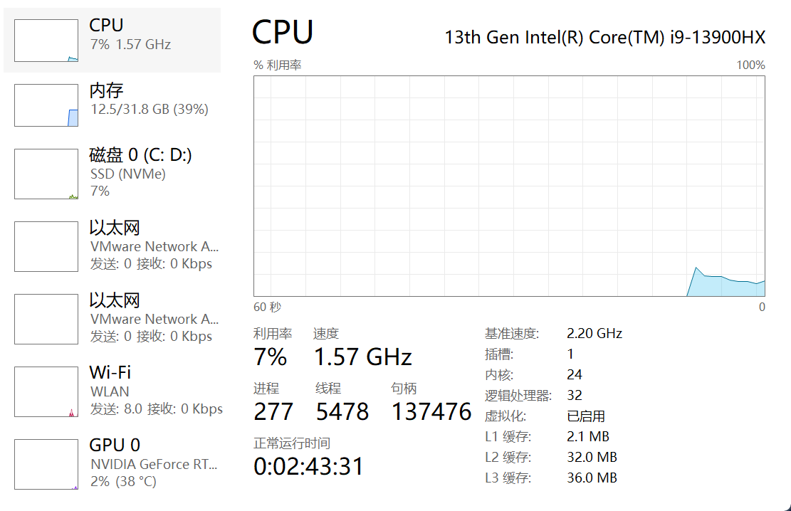
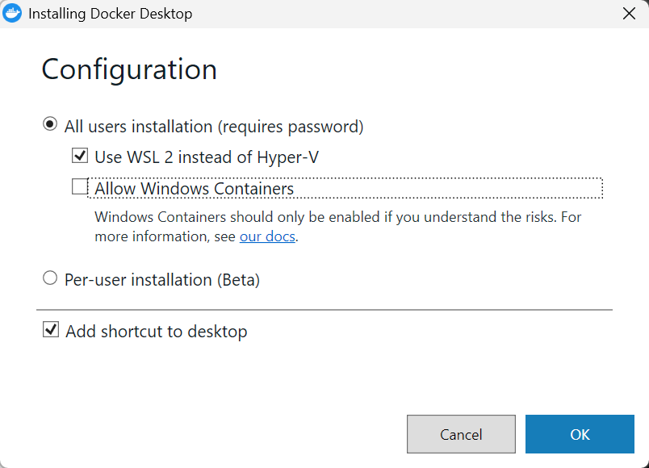

[【2026最新保姆级】Windows安装Docker Desktop完整教程：汉化+国内镜像+不占C盘+避坑指南_docker desktop安装教程-CSDN博客](https://blog.csdn.net/2303_80828979/article/details/160235606)


安装exe

https://docs.docker.com/desktop/setup/install/windows-install/

# [Windows如何卸载并重装Docker Desktop，安装路径到f盘](https://www.cnblogs.com/yylucky666/p/18884384)

~~首先是要卸载干净，手动把 `C:/Program Files/Docker，C:\Users\Administrator\AppData\Local\Docker，C:\ProgramData\Docker` 的文件删除，发现没卸载干净，重装会提示 Exising installation is up to date，这是因为我本地之前安装过docker，注册表还没有清理干净。~~

~~解决方案：~~
~~按下Window+R唤起命令输入界面，输入regedit打开注册表编辑~~
~~在地址栏输入HKEY_LOCAL_MACHINE\SOFTWARE\Microsoft\Windows\CurrentVersion\Uninstall\Docker Desktop~~
~~将整个Docker Desktop组点击右键删~~

**不要瞎删啊！！！虽然也是不知道是动注册表了还是啥，出现 0x800f0915只能拿win11官方iso镜像覆盖安装了。。。**


使用命令安装

 "Docker Desktop Installer.exe" install --installation-dir="D:\Program Files\Docker"

1.由于windows安装docker强制安装到c盘，可以通过以下方式安装到其它盘

执行命令，

mklink /j "C:\Program Files\Docker" "E:\Docker"

2.然后修改镜像下载位置 执行以下命令

mklink /j C:\Users\Administrator\AppData\Local\Docker\wsl "E:\Docker\wsl"

3.打开安装程序，重新安装

## 前置:cpu虚拟化




## [前置：WSL+ubuntu安装](https://blog.csdn.net/Natsuago/article/details/145594631?spm=1001.2014.3001.5501)

额外参考[WSL 完全指南：从安装到进阶，解决常见问题_get-service : 找不到任何服务名称为“lxssmanager”的服务。-CSDN博客](https://blog.csdn.net/2503_91821476/article/details/152045626)

`wsl --install` `wsl --update`全失败：

```
wsl --install
无法从“https://raw.githubusercontent.com/microsoft/WSL/master/distributions/DistributionInfo.json”提取列表分发。与服务器的连接被重置
错误代码: Wsl/InstallDistro/0x80072eff

与服务器的连接被重置
错误代码: Wsl/UpdatePackage/0x80072eff
```


于是手动下载github release：https://github.com/microsoft/WSL/releases

​	还有一种`wsl --update --web-download`直接走GitHub release


[Ubuntu Cloud Images](https://cloud-images.ubuntu.com/releases/)离线ubuntu安装

[Index of /ubuntu-releases/24.04/ | 清华大学开源软件镜像站 | Tsinghua Open Source Mirror](https://mirrors.tuna.tsinghua.edu.cn/ubuntu-releases/24.04/)


### 下载完ubuntu离线安装包.wsl后导入：

wsl --import Ubuntu-24.04 D:\wsl\ubuntu24 D:\path\to\your\ubuntu-24.04-wsl-amd64.wsl --version 2

- `Ubuntu-24.04`：给这个 WSL 发行版起的名称（可自定义）  
- `D:\wsl\ubuntu24`：实际存放 WSL 系统文件的路径  
- `D:\path\to\your\ubuntu-24.04-wsl-amd64.wsl`：你下载的 `.wsl` 文件的完整路径

我的实际使用：`wsl --import Ubuntu-26.04 "D:\Docker\WSL\Ubuntu 26.04" "D:\Edge\ubuntu-26.04-wsl-amd64.wsl" --version 2`

```powershell
(base) PS C:\Users\lenovo> wsl --import Ubuntu-26.04 "D:\Docker\WSL\Ubuntu 26.04" "D:\Edge\ubuntu-26.04-wsl-amd64.wsl" --version 2
操作成功完成。
```

启动(并初始化 Ubuntu)：`wsl -d Ubuntu-26.04`

(base) PS C:\Users\lenovo> wsl -d Ubuntu-26.04
root@LAPTOP-PGIP7SFO:/mnt/c/Users/lenovo#

### ubuntu添加普通用户

```bash
root@LAPTOP-PGIP7SFO:/mnt/c/Users/lenovo# adduser vasant
New password:(11111)
Retype new password:
passwd: password updated successfully
Changing the user information for vasant
Enter the new value, or press ENTER for the default
        Full Name []:
        Room Number []:
        Work Phone []:
        Home Phone []:
        Other []:
Is the information correct? [Y/n] Y
```

### ubuntu赋予用户权限

新用户就可以使用 `sudo` 进行管理员操作

```bash
root@LAPTOP-PGIP7SFO:/mnt/c/Users/lenovo# usermod -aG sudo vasant
```

### 查看安装状态

```cmd
  C:\Users\lenovo>wsl -l -v
    NAME              STATE           VERSION
  
  * docker-desktop    Stopped         2
    Ubuntu-26.04      Stopped         2
```

###  WSL重启

`wsl --shutdown`


```
# 1. 启用 WSL 功能
dism.exe /online /enable-feature /featurename:Microsoft-Windows-Subsystem-Linux /all /norestart
```


###  WSL 配置：减少内存占用
会遇到Vmmem在WSL运行时内存占用过高问题

在 `C:\Users\你的用户名\.wslconfig` 文件中配置：

```ini
[wsl2]
memory=4GB# 限制最大内存
processors=2# 限制CPU核心数
swap=4GB# 交换分区大小
localhostForwarding=true# 启用 localhost 转发
kernelCommandLine = vsyscall=emulate
pageReporting = false #不允许内存回收
```

配置后运行`wsl --shutdown`重启


### 自定义docker安装路径:直接用命令移动
- Docker Desktop 主程序很小（约1GB），必须装在 C 盘
- 真正占用空间的是 **WSL 数据、镜像、容器**，这些可以移到 D 盘
- 通过符号链接欺骗系统，实现变相安装到 D 盘


如果你还没安装，按这个流程：

1. **先创建 D 盘目标文件夹**：
   ```
   D:\Docker\Data
   D:\Docker\WSL
   ```

2. **正常安装 Docker Desktop**，安装完不要启动

3. **立即以管理员身份运行 PowerShell**：

   ```powershell
   # 移动 AppData 中的 Docker 目录
   $sourcePath = "$env:LOCALAPPDATA\Docker"
   $targetPath = "D:\Docker\Data"
   
   if (!(Test-Path $sourcePath)) {
       New-Item -ItemType Directory -Path $sourcePath -Force
   }
   
   # 如果目标已存在数据，先移动
   if (Test-Path $sourcePath) {
       robocopy $sourcePath $targetPath /E /MOVE
   }
   
   # 创建符号链接
   cmd /c mklink /D $sourcePath $targetPath
   
   # 移动 WSL 存储位置
   $wslConfig = @"
   [wsl2]
   memory=4GB
   swap=4GB
   "@
   $wslConfig | Out-File -FilePath "$env:USERPROFILE\.wslconfig" -Encoding utf8
   ```

​	运行过程：

```powershell
(base) PS C:\Users\lenovo> # 移动 AppData 中的 Docker 目录
(base) PS C:\Users\lenovo> $sourcePath = "$env:LOCALAPPDATA\Docker"
(base) PS C:\Users\lenovo> $targetPath = "D:\Docker\Data"
(base) PS C:\Users\lenovo>
(base) PS C:\Users\lenovo> if (!(Test-Path $sourcePath)) {
>>     New-Item -ItemType Directory -Path $sourcePath -Force
>> }
(base) PS C:\Users\lenovo>
(base) PS C:\Users\lenovo> # 如果目标已存在数据，先移动
(base) PS C:\Users\lenovo> if (Test-Path $sourcePath) {
>>     robocopy $sourcePath $targetPath /E /MOVE
>> }

-------------------------------------------------------------------------------
   ROBOCOPY     ::     Windows 的可靠文件复制
-------------------------------------------------------------------------------

  开始时间: 2026年5月13日 23:57:18
        源: C:\Users\lenovo\AppData\Local\Docker\
      目标: D:\Docker\Data\

      文件: *.*

      选项: *.* /S /E /DCOPY:DA /COPY:DAT /MOVE /R:1000000 /W:30

------------------------------------------------------------------------------

          新目录           1    C:\Users\lenovo\AppData\Local\Docker\
100%        新文件                   943        install-log.txt
          新目录           0    C:\Users\lenovo\AppData\Local\Docker\log\
          新目录           1    C:\Users\lenovo\AppData\Local\Docker\log\host\
100%        新文件                  2084        Docker Desktop Installer.exe.log

------------------------------------------------------------------------------

                  总数        复制        跳过       不匹配        失败        其他
       目录:         3         3         0         0         0         0
       文件:         2         2         0         0         0         0
       字节:     2.9 k     2.9 k         0         0         0         0
       时间:   0:00:00   0:00:00                       0:00:00   0:00:00
       速度:           1,513,500 字节/秒。
       速度:              86.603 MB/分钟。
   已结束: 2026年5月13日 23:57:18

(base) PS C:\Users\lenovo>
(base) PS C:\Users\lenovo> # 创建符号链接
(base) PS C:\Users\lenovo> cmd /c mklink /D $sourcePath $targetPath
为 C:\Users\lenovo\AppData\Local\Docker <<===>> D:\Docker\Data 创建的符号链接
(base) PS C:\Users\lenovo>
(base) PS C:\Users\lenovo> # 移动 WSL 存储位置
(base) PS C:\Users\lenovo> $wslConfig = @"
>> [wsl2]
>> memory=4GB
>> swap=4GB
>> "@
(base) PS C:\Users\lenovo> $wslConfig | Out-File -FilePath "$env:USERPROFILE\.wslconfig" -Encoding utf8
(base) PS C:\Users\lenovo> wsl --list -v
  NAME            STATE           VERSION
* Ubuntu-26.04    Stopped         2
(base) PS C:\Users\lenovo> dir $env:LOCALAPPDATA\Docker
    目录: C:\Users\lenovo\AppData\Local\Docker
Mode                 LastWriteTime         Length Name
----                 -------------         ------ ----
d-----         2026/5/13     23:53                log
-a----         2026/5/13     23:53            943 install-log.txt
```


4. **启动 Docker Desktop**，它会自动在 D 盘创建数据

```powershell
# 检查 WSL 发行版位置
wsl --list -v

# 检查符号链接
dir $env:LOCALAPPDATA\Docker
```

**关键提醒**：

- C 盘仍会占用约 1GB 的主程序空间，这是无法避免的
- 镜像、容器、WSL 虚拟磁盘等大头数据会在 D 盘
- 如果之前遇到过 WSL 错误，记得先修复（启动 LxssManager 服务）


## 安装docker desktop(覆盖安装前安在d盘了)

```powershell
(base) PS D:\Edge> .\"Docker Desktop Installer.exe" --help
Installs Docker Desktop

"Docker Desktop Installer.exe" install [--quiet] [--accept-license] [--backend=wsl-2 | --backend=hyper-v | --backend=windows] [--allowed-org=<org name>]

"Docker Desktop Installer.exe" validate
  Validates Authenticode signatures of all files in the current installation

--quiet                   Suppresses information output when running the installer
--accept-license          Accepts the Docker Subscription Service Agreement now, rather than requiring it to be accepted when the application is first run
--no-windows-containers   Disables Windows containers integration (cannot be used with --backend=windows)
--allowed-org=<org name>  Requires the user to sign in and be part of the specified Docker Hub organization when running the application
--backend=<backend name>  Selects the default backend to use for Docker Desktop, hyper-v, windows or wsl-2 (default)
--always-run-service  Keep service always running, so regular users can switch to windows containers or hyper-v without being prompted for admin rights
--installation-dir=<path> Changes the default installation location (C:\Program Files\Docker\Docker)
--hyper-v-default-data-root=<path> Changes the default hyper-v VM disk location
--windows-containers-default-data-root=<path> Changes the default windows containers data root
--wsl-default-data-root=<path> Changes the default wsl data location
--admin-settings=<json> Used as admin settings for hardened desktop (needs to use --allowed-org and specify a business tier org)
--proxy-http-mode=<mode> HTTP Proxy mode, system (default) or manual
--override-proxy-http=<URL> URL of the HTTP proxy that must be used for outgoing HTTP requests
--override-proxy-https=<URL> URL of the HTTP proxy that must be used for outgoing HTTPS requests
--override-proxy-exclude=<hosts/domains> Bypass proxy settings for these hosts & domains, comma-separated list
--override-proxy-pac=<URL> URL of the Proxy Auto-Configuration (PAC) file that defines the proxy settings
--override-proxy-embedded-pac=<PAC Script> Specifies an embedded PAC (Proxy Auto-Config) script
--proxy-enable-kerberosntlm Enables Kerberos/NTLM proxy authentication
```

然后尝试用命令行参数定义d盘安装

```powershell
(base) PS D:\Edge> .\"Docker Desktop Installer.exe" install --installation-dir="D:\Docker"
```




结果安装失败：

```
Component Docker.Installer.EnableFeaturesAction failed: Failed to install features with exit code 14098: 
部署映像服务和管理工具
版本: 10.0.26100.1150

映像版本: 10.0.26100.4652

启用一个或多个功能

[                           0.1%                           ] 

[                           1.1%                           ] 

[=                          2.1%                           ] 
...

[===========================73.3%==========                ] 

[===========================74.3%===========               ] 

[==========================100.0%==========================] 

错误: 14098

组件存储已损坏。

可以在 C:\WINDOWS\Logs\DISM\dism.log 上找到 DISM 日志文件

```


检查并修复系统文件

```powershell
(base) PS C:\Users\lenovo> sfc /scannow

开始系统扫描。此过程将需要一些时间。

开始系统扫描的验证阶段。
验证 100% 已完成。
```

使用 DISM 修复组件存储（需要联网）

```powershell 
(base) PS C:\Users\lenovo> DISM /Online /Cleanup-Image /RestoreHealth

部署映像服务和管理工具
版本: 10.0.26100.1150

映像版本: 10.0.26100.4652

[===========================62.3%====                      ]
```

为什么一直卡着啊...... 正在试挂vpn直接安装

跟着kimi再来一次

```cmd
C:\Users\lenovo>DISM /Online /Cleanup-Image /ScanHealth

部署映像服务和管理工具
版本: 10.0.26100.1150

映像版本: 10.0.26100.4652

[==========================100.0%==========================] 可以修复组件存储。
操作成功完成。

C:\Users\lenovo>DISM /Online /Cleanup-Image /CheckHealth

部署映像服务和管理工具
版本: 10.0.26100.1150

映像版本: 10.0.26100.4652

可以修复组件存储。
操作成功完成。

C:\Users\lenovo>DISM /Online /Cleanup-Image /RestoreHealth

部署映像服务和管理工具
版本: 10.0.26100.1150

映像版本: 10.0.26100.4652

[===========================62.3%====                      ]
```

好家伙都是亲人们[Windows系统修复 Dism修复卡在62.3% - 哔哩哔哩](https://www.bilibili.com/opus/793662935204364310)真的是联想通病吗。。。


再开安全模式试一下......可否有神医救一下啊

```cmd
C:\Users\lenovo>DISM /Online /Cleanup-Image /RestoreHealth

部署映像服务和管理工具
版本: 10.0.26100.1150

映像版本: 10.0.26100.4652

[==========================100.0%==========================]
错误: 0x800f0915

在任何位置都找不到修复内容。
检查 Internet 连接或使用“源”选项来指定还原映像所需的文件的位置。有关指定源 位置的详细信息，请参阅 https://go.microsoft.com/fwlink/?LinkId=243077。

可以在 C:\WINDOWS\Logs\DISM\dism.log 上找到 DISM 日志文件
```

是能运行完了但是仍然0x800f0915

再先下载[win11 iso镜像](https://www.microsoft.com/zh-cn/software-download/windows11)作为修复源试一下：

```
DISM /Online /Cleanup-Image /RestoreHealth /Source:D:\Edge\Win11_25H2_Chinese_Simplified_x64_v2\sources\install.wim:4 /LimitAccess
```

没招了也不行 0x800f0915

正在试重装

又出现个检查更新46 笑死

安装选项修改成不是现在

**神医！！！安全下车但是wsl和ubuntu好像整c盘里了，需要重新迁移**

docker desktop安装过程中的弹窗 估计是之前powershell的命令还在生效，但是wsl和ubuntu不在d盘了

```bash
configuring docker in Ubuntu-26.04: docker cli config: failed to write file: running wslexec: An error occurred while running the command. Wsl/Service/CreateInstance/MountDisk/HCS/ERROR_PATH_NOT_FOUND: c:\windows\system32\wsl.exe -d ubuntu-26.04 -e sh -c cat - > ~/.docker/config.json: exit status 0xffffffff (stderr: , stdout: 无法将磁盘“D:\Docker\WSL\Ubuntu 26.04\ext4.vhdx”附加到 WSL2: 系统找不到指定的路径。 
错误代码: Wsl/Service/CreateInstance/MountDisk/HCS/ERROR_PATH_NOT_FOUND
, wslErrorCode: Wsl/Service/CreateInstance/MountDisk/HCS/ERROR_PATH_NOT_FOUND)
```

## 装docker desktop

### wsl部分导入 （D:\Docker\Data部分在前面章节

```powershell
# 关闭所有 WSL
wsl --shutdown

# 准备目标目录
New-Item -ItemType Directory -Path "D:\Docker\WSL" -Force

# 导出
wsl --export docker-desktop "D:\Docker\WSL\docker-desktop.tar"

# 注销原发行版（会删除 C 盘虚拟磁盘）
wsl --unregister docker-desktop

# 导入到新位置
wsl --import docker-desktop "D:\Docker\WSL\docker-desktop" "D:\Docker\WSL\docker-desktop.tar"

# 删除临时备份
Remove-Item "D:\Docker\WSL\docker-desktop.tar"
```

### Docker Root Dir数据位置

```powershell
(base) PS C:\Users\lenovo> docker info | findstr "Docker Root Dir"
  agent: Docker AI Agent Runner (Docker Inc.)
    Path:     C:\Program Files\Docker\cli-plugins\docker-agent.exe
  ai: Docker AI Agent - Ask Gordon (Docker Inc.)
    Path:     C:\Program Files\Docker\cli-plugins\docker-ai.exe
  buildx: Docker Buildx (Docker Inc.)
    Path:     C:\Program Files\Docker\cli-plugins\docker-buildx.exe
  compose: Docker Compose (Docker Inc.)
    Path:     C:\Program Files\Docker\cli-plugins\docker-compose.exe
  debug: Get a shell into any image or container (Docker Inc.)
    Path:     C:\Program Files\Docker\cli-plugins\docker-debug.exe
  desktop: Docker Desktop commands (Docker Inc.)
    Path:     C:\Program Files\Docker\cli-plugins\docker-desktop.exe
  dhi: CLI for managing Docker Hardened Images (Docker Inc.)
    Path:     C:\Program Files\Docker\cli-plugins\docker-dhi.exe
  extension: Manages Docker extensions (Docker Inc.)
    Path:     C:\Program Files\Docker\cli-plugins\docker-extension.exe
  init: Creates Docker-related starter files for your project (Docker Inc.)
    Path:     C:\Program Files\Docker\cli-plugins\docker-init.exe
  mcp: Docker MCP Plugin (Docker Inc.)
    Path:     C:\Program Files\Docker\cli-plugins\docker-mcp.exe
  model: Docker Model Runner (Docker Inc.)
    Path:     C:\Program Files\Docker\cli-plugins\docker-model.exe
  offload: Docker Offload (Docker Inc.)
    Path:     C:\Program Files\Docker\cli-plugins\docker-offload.exe
  pass: Docker Pass Secrets Manager Plugin (beta) (Docker Inc.)
    Path:     C:\Program Files\Docker\cli-plugins\docker-pass.exe
  sandbox: Docker Sandbox (Docker Inc.)
    Path:     C:\Program Files\Docker\cli-plugins\docker-sandbox.exe
    Path:     C:\Program Files\Docker\cli-plugins\docker-sbom.exe
  scout: Docker Scout (Docker Inc.)
    Path:     C:\Program Files\Docker\cli-plugins\docker-scout.exe
 Operating System: Docker Desktop
 Docker Root Dir: /var/lib/docker
```

### Docker 国内镜像
deamon.json配置：

```json
{
  "builder": {
    "gc": {
      "defaultKeepStorage": "20GB",
      "enabled": true
    }
  },
  "experimental": false,
  "registry-mirrors": [
    "https://docker.1ms.run",
    "https://docker.1panel.live",
    "https://hub.rat.dev"
  ]
}
```

1. `builder` (镜像构建器配置)

控制 Docker 镜像构建过程中的资源管理，特别是构建缓存。

- **`gc` (垃圾回收)**
  自动清理不再使用的构建缓存，避免磁盘占满。
  - **`enabled: true`**
    开启构建缓存的自动垃圾回收。
  - **`defaultKeepStorage: "20GB"`**
    保留最近使用的构建缓存总量不超过 20 GB。
    超过此限制时，Docker 会删除最旧的缓存，保留最近使用部分。

> 这对频繁构建镜像的环境很有用，防止 `/var/lib/docker` 无限膨胀。

2. `experimental` (实验功能开关)

- **`false`**
  关闭 Docker Engine 的实验性功能。
  设为 `true` 可开启一些不稳定、未来可能变更的特性（如 `docker build --squash`、`docker checkpoint` 等）。
  生产环境通常设为 `false`。

3. `registry-mirrors` (镜像加速器列表)

Docker Hub 拉取镜像时，优先使用这里配置的国内/第三方镜像代理，提升下载速度。


*镜像源：轩辕的免费版用着说Error response from daemon: unable to fetch descriptor (sha256:5b10f432ef3da1b8d4c7eb6c487f2f5a8f096bc91145e68878dd4a5019afde11) which reports content size of zero: invalid argument，就换掉了*

```bash
root@LAPTOP-PGIP7SFO:~# docker run hello-world

Hello from Docker!
This message shows that your installation appears to be working correctly.

To generate this message, Docker took the following steps:
 1. The Docker client contacted the Docker daemon.
 2. The Docker daemon pulled the "hello-world" image from the Docker Hub.
    (amd64)
 3. The Docker daemon created a new container from that image which runs the
    executable that produces the output you are currently reading.
 4. The Docker daemon streamed that output to the Docker client, which sent it
    to your terminal.

To try something more ambitious, you can run an Ubuntu container with:
 $ docker run -it ubuntu bash

Share images, automate workflows, and more with a free Docker ID:
 https://hub.docker.com/

For more examples and ideas, visit:
 https://docs.docker.com/get-started/
```


5.14.2.03 干不动了。。。。总算是安完了


---

如果你愿意，我可以帮你写一个完整脚本，实现从 `.wsl` 文件导入 → 创建用户 → 自动安装 Docker Desktop 集成的一键配置。