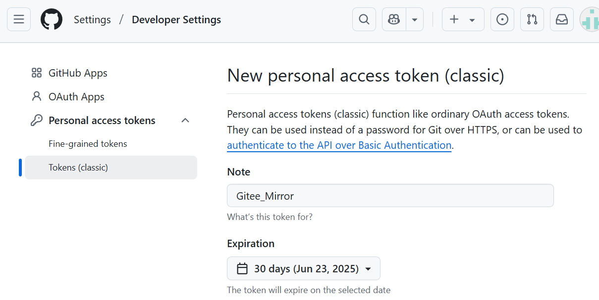
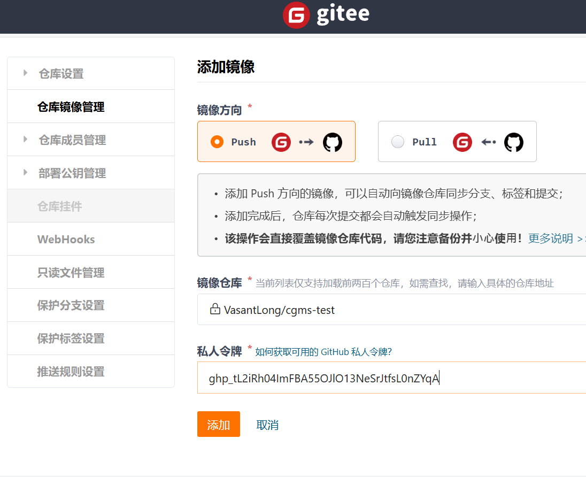

https://docs.github.com/en/authentication/troubleshooting-ssh/using-ssh-over-the-https-port

在github上连接ssh

## [启用通过 HTTPS 的 SSH 连接](https://docs.github.com/zh/authentication/troubleshooting-ssh/using-ssh-over-the-https-port#enabling-ssh-connections-over-https)

如果你能在端口 443 上通过 SSH 连接到 `git@ssh.github.com`，则可覆盖你的 SSH 设置来强制与 GitHub.com 的任何连接均通过该服务器和端口运行。

要在 SSH 配置文件中设置此行为，请在 `~/.ssh/config` 编辑该文件，并添加以下部分：

```text
Host github.com
    Hostname ssh.github.com
    Port 443
    User git
```


构建config文件：txt保存 重命名config.config 删除.config保存

## 使用不同用户管理不同仓库

### [使用Git bash切换Gitee、GitHub多个Git账号](https://blog.csdn.net/sanqima/article/details/134588095)

配置后出现问题：Could not open a connection to your authentication agent.

在`ssh-add ~/.ssh/id_rsa_gitee`之前运行

```git
ssh-agent bash
```

### [Git 如何在推送仓库时切换不同用户](https://geek-docs.com/git/git-questions/72_git_how_do_i_switch_between_different_usersgithub_accounts_when_pushing_repositories.html)

1. 创建多个账户配置文件
   git bash输入以下命令创建user文件：

    ```bash
    $ touch ~/.gitconfig-user1
    $ touch ~/.gitconfig-user2
    ```

2. 打开”~/.gitconfig-user1″文件，输入以下内容：

   ```
   [user]
       name = User1
       email = user1@example.com
   ```

3. 在C:/Users/lenovo/.gitconfig中配置：

    ```cmd
    [includeIf "gitdir:/home/yourusername/path/to/your/repo1/"]
        path = /home/yourusername/.gitconfig-user1
    [includeIf "gitdir:/home/yourusername/path/to/your/repo2/"]
        path = /home/yourusername/.gitconfig-user2
    ```

​	一定要注意**双引号**......

​	还有Git的`includeIf`指令通常建议在目录**路径末尾加上斜杠`/`**......

## 账号间的转移仓库

由于手机号166后期会注销，fff7788正式停用

Gitee仓库管理>转移仓库>转移给成员

注：地址名需要不一样


## commit撤销

```
git reset --soft HEAD^
```

HEAD^ 表示上一个版本，即上一次的commit，也可以写成HEAD~1
如果进行两次的commit，想要都撤回，可以使用HEAD~2
–soft  不删除工作空间的改动代码 ，撤销commit，不撤销git add file


## 远端仓库改名后本地操作

1. 查看当前远端仓库名

    ```
    git remote -v
    ```

2. 修改

    ```
    git remote set-url origin xxxxx.git
    ```

3. 尝试push


## [Git 如何使用Git将一个分支中的更改复制到另一个分支](https://geek-docs.com/git/git-questions/1864_git_copy_changes_from_one_branch_to_another.html)


## GitHub Pages

[保姆级教程：从零构建GitHub Pages静态网站](https://blog.csdn.net/qq_20042935/article/details/133920722)

## Permission denied (publickey)

[解决 Git 连接时出现 Permission denied (publickey)的解决指南 - 知乎](https://zhuanlan.zhihu.com/p/26606674562)

IdentitiesOnly yes


## 镜像+双平台同步

[仓库镜像管理 （ Gitee <-> Github 双向同步） - Gitee.com](https://gitee.com/help/articles/4336#article-header0)

### 获取github私人令牌（勾选repo和admin）



### gitee镜像

push：gitee提交完，更改github


