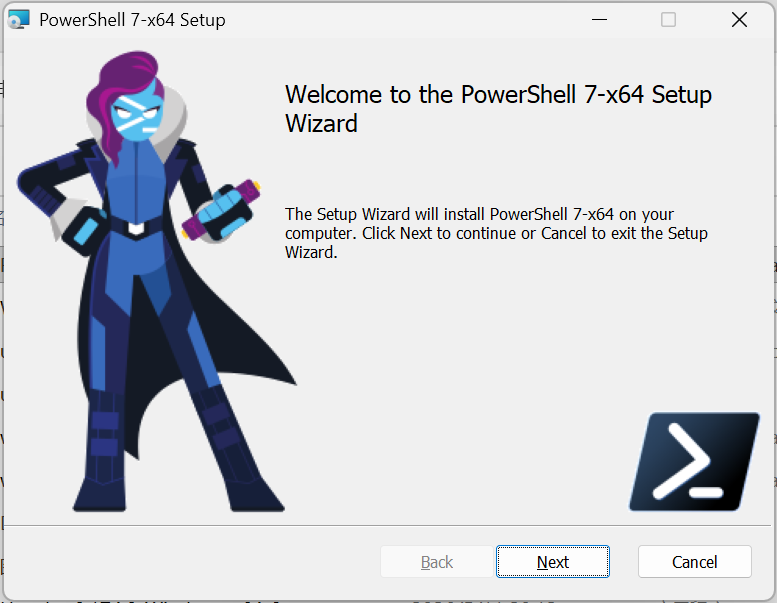
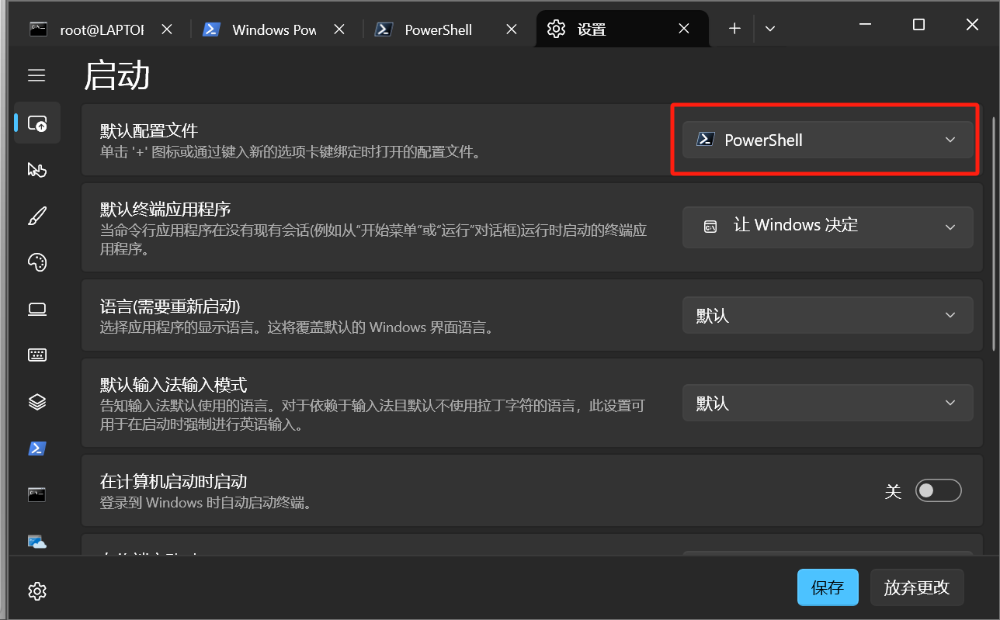
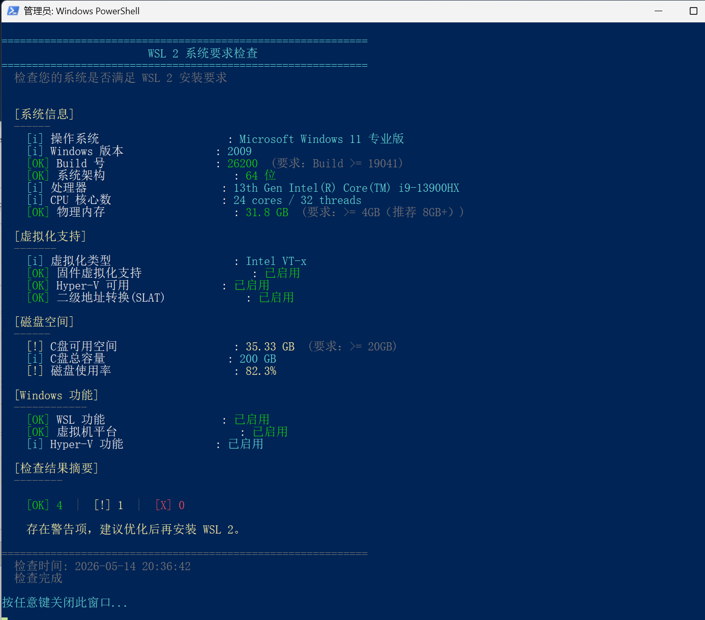
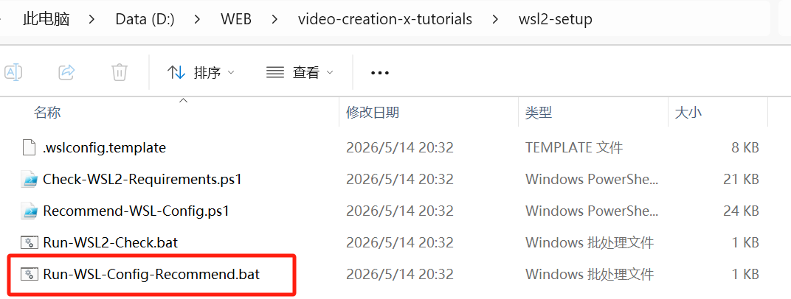
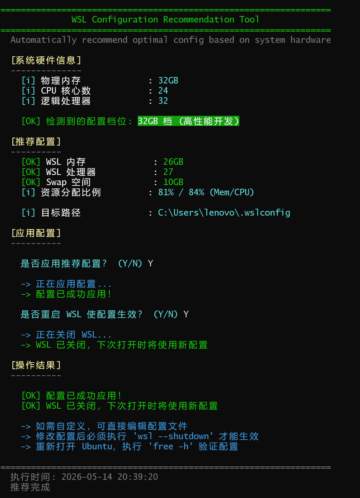
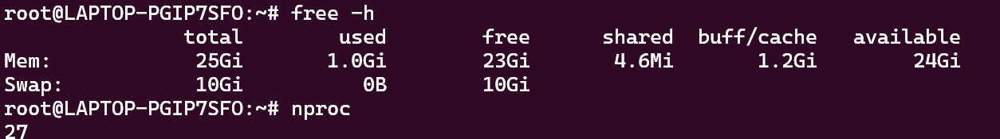
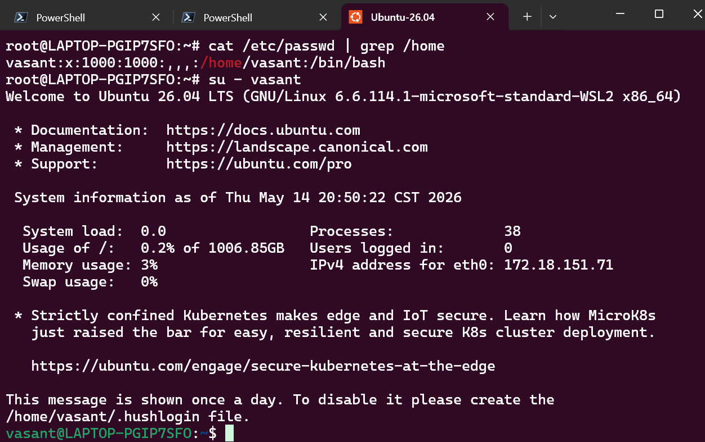
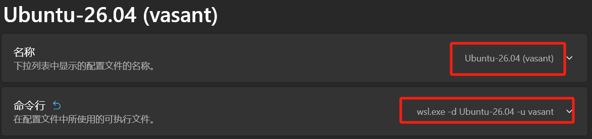
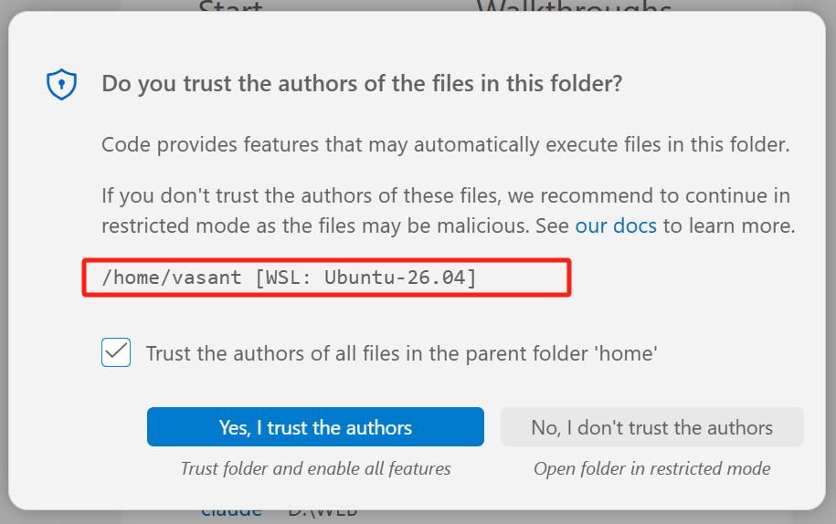

```
(base) PS C:\Users\lenovo> $PSVersionTable

Name                           Value
----                           -----
PSVersion                      5.1.26100.7920
PSEdition                      Desktop
PSCompatibleVersions           {1.0, 2.0, 3.0, 4.0...}
BuildVersion                   10.0.26100.7920
CLRVersion                     4.0.30319.42000
WSManStackVersion              3.0
PSRemotingProtocolVersion      2.3
SerializationVersion           1.1.0.1

PS C:\Users\lenovo> winget install Microsoft.Powershell
已找到 PowerShell [Microsoft.PowerShell] 版本 7.6.1.0
此应用程序由其所有者授权给你。
Microsoft 对第三方程序包概不负责，也不向第三方程序包授予任何许可证。
正在下载 https://github.com/PowerShell/PowerShell/releases/download/v7.6.1/PowerShell-7.6.1.msixbundle
执行此命令时发生意外错误：
InternetOpenUrl() failed.
0x80072eff : unknown error
```

只能去GitHub安完.msi安装了



重启终端之后，验证安装

```
(base) PS C:\Users\lenovo> pwsh
PowerShell 7.6.1
PS C:\Users\lenovo> $PSVersionTable

Name                           Value
----                           -----
PSVersion                      7.6.1
PSEdition                      Core
GitCommitId                    7.6.1
OS                             Microsoft Windows 10.0.26200
Platform                       Win32NT
PSCompatibleVersions           {1.0, 2.0, 3.0, 4.0…}
PSRemotingProtocolVersion      2.4
SerializationVersion           1.1.0.1
WSManStackVersion              3.0
```

再改一下默认启动



（检查wsl前置条件）：bios CPU虚拟化等等https://github.com/ForeverDreamer/video-creation-x-tutorials/releases/tag/wsl2-setup-v1.0

脚本检查




然后就是wsl2安装：`wsl --install`自动包含安装ubuntu，再重启

`wsl --list --online`查看可用发行版列表

`wsl --install --Ubuntu-26.04`安装ubuntu一个LTS版本

安装完毕后自动进入


平时启动：`wsl -d Ubuntu-26.04`或者直接打开ubuntu终端


**查看**系统版本信息

```bash
root@LAPTOP-PGIP7SFO:/mnt/c/Users/lenovo# cat /etc/os-release
PRETTY_NAME="Ubuntu 26.04 LTS"
NAME="Ubuntu"
VERSION_ID="26.04"
VERSION="26.04 (Resolute Raccoon)"
VERSION_CODENAME=resolute
ID=ubuntu
ID_LIKE=debian
HOME_URL="https://www.ubuntu.com/"
SUPPORT_URL="https://help.ubuntu.com/"
BUG_REPORT_URL="https://bugs.launchpad.net/ubuntu/"
PRIVACY_POLICY_URL="https://www.ubuntu.com/legal/terms-and-policies/privacy-policy"
UBUNTU_CODENAME=resolute
LOGO=ubuntu-logo
```

接下来wsl性能优化

查看.wslconfig是否存在

```
PS C:\Users\lenovo> Test-Path $env:USERPROFILE\.wslconfig
True
```

当前内存

```
root@LAPTOP-PGIP7SFO:/mnt/c/Users/lenovo# free -h
               total        used        free      shared  buff/cache   available
Mem:           3.8Gi       690Mi       2.0Gi       4.4Mi       1.2Gi       3.2Gi
Swap:          4.0Gi          0B       4.0Gi
```

使用项目脚本运行，寻找最佳配置



运行结果



此时内存：存在内核保留，所以实际是比预设低一些 e.g. 26→25 

cpu核相同



发现一直没从root转成普通用户：`su - 普通用户名`




关于root与普通用户：

只有**写入/修改**操作才会改变系统，比如：

- `rm` - 删除文件
- `mv` - 移动/重命名文件
- `chmod`/`chown` - 修改权限
- `apt install`/`apt remove` - 安装/卸载软件
- 用 `>` 或 `>>` 重定向写入文件

而 `cat`（查看）、`ls`（列表）、`pwd`（当前路径）这类命令只是**查看信息**，即使以 root 执行也完全无害。


添加普通用户lenovo并设置为默认用户：

```bash
adduser lenovo
usermod -aG sudo lenovo

sudo cat > /etc/wsl.conf << EOF
[user]
default=lenovo
EOF
```

然后wsl --shutdown重启


设置一下普通用户vasant的终端配置，直接进入 `wsl.exe -d Ubuntu-26.04 -u vasant`




现在在vscode安装wsl拓展


注意路径选普通用户而不是root



查看linux系统信息&查看c盘

```bash
vasant@LAPTOP-PGIP7SFO:~$ uname -a
Linux LAPTOP-PGIP7SFO 6.6.114.1-microsoft-standard-WSL2 #1 SMP PREEMPT_DYNAMIC Mon Dec  1 20:46:23 UTC 2025 x86_64 GNU/Linux
vasant@LAPTOP-PGIP7SFO:~$ ls /mnt/c 2>/dev/null
 '$Recycle.Bin'                Users
 Config.Msi                    Windows
 'Documents and Settings'      Windows.old
 DumpStack.log.tmp             XboxGames
 GameHL                        appverifUI.dll
 Intel                         bstlog
 Lenovo                        etc
 Microsoft                     inetpub
 PerfLogs                      logUploaderSettings.ini
 'Program Files'               logUploaderSettings_temp.ini
 'Program Files (x86)'         pcsuite
 ProgramData                   pycharmCrack
 Recovery                      swapfile.sys
 'System Volume Information'   vfcompat.dll
```

`explorer.exe 'C:\'`用不了：说明Windows 路径没在 WSL 的环境变量

以下修改 `.bashrc`

```bash
vasant@LAPTOP-PGIP7SFO:~$ echo 'export PATH="$PATH:/mnt/c/Windows:/mnt/c/Windows/System32"' >> ~/.bashrc
source ~/.bashrc
```

`echo $PATH | grep Windows`：输出里有 `/mnt/c/Windows` 就说明添加成功

打开win c盘资源管理器`explorer.exe C:\\`

打开linux当前目录`explorer.exe .`


